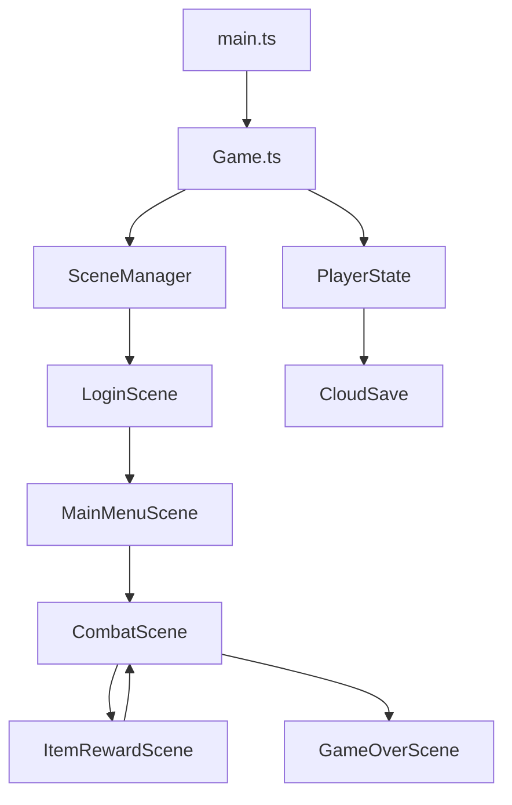

# ⚔️ Typing RPG

這是一款基於 PixiJS 開發的打字冒險遊戲，結合了 **RPG 戰鬥**、**道具收集** 與 **挑戰性打字機制**。玩家透過鍵盤輸入英文字母或單字來發動攻擊，擊敗不斷增強的怪物。

---

## 📈 1. 專案開發計畫 (Development Plan)

### 🚩 現階段 (Current Status)

* **核心組件**：PixiJS v8 渲染引擎、場景切換系統 (SceneManager)。
* **遊戲系統**：戰鬥循環、道具三選一、成就解鎖、本地排行榜。
* **同步系統**：Google Sheets 雲端存檔 (GAS) 整合與本地 `localStorage` 雙備份。

### 🚀 待開發 (Future Goals)

* [x] **雲端排行榜**：實作與 Google Sheets 同步的全服分類排行榜。
* [x] **強化版新手模式**：針對錯字加強練習、動態權重與傷害加成機制。
* [ ] **多樣化怪物**：增加具備特殊技能的怪物與 Boss。
* [ ] **動態難度**：實作根據玩家表現自動調整的難度曲線。
* [ ] **視覺強化**：更多場景背景、背景音樂 (BGM) 與打擊音效。

---

## 🎮 2. 遊戲規則 (Game Rules)

### 難度模式 (Difficulty Modes)

| 模式 | 內容 | 時間限制 | 特色 |
| :--- | :--- | :--- | :--- |
| **Beginner** | 隨機字母 (Lv.1) / 單字 (Lv.2+) | **無時間限制** | 錯字加權出現、針對弱點給予 1.5x 傷害補償 |
| **Intermediate** | 隨機英文單字 | 固定 25 秒 | 標準打字練習模式 |
| **Advanced** | 隨機英文單字 | **極限 5 秒** | 極速挑戰模式 |

### 戰鬥與 Combo 機制

* **打字連結攻擊**：連續輸入正確字元會累積 **Combo**，直接影響分數與視覺特效。
* **Combo 獎勵加成**：
  * `5 Combo`: **Good!**
  * `10 Combo`: **Great!** (攻擊力 +10%)
  * `15 Combo`: **Excellent!** (攻擊力 +20%)
  * `20 Combo`: **PERFECT!** (攻擊力 +50%)
* **準確度 (Accuracy)**：影響最終造成的傷害倍率。
  * **Perfect (100%)**: 2.0x 傷害
  * **Great (>=90%)**: 1.5x 傷害
  * **Good (>=80%)**: 1.25x 傷害
* **計分公式 (Score)**：
  * **基礎得分**：每正確輸入一個字母可獲得 **10 分**。
  * **加成效果**：解鎖「學者 (Scholar)」成就後，獲得額外 **10% 分數加成**。
* **怪物反擊**：若輸入錯誤或時間耗盡，怪物會發動反擊。

### 道具系統 (Item System)

每過一關可執行 **三選一**。

| 稀有度 | 出現機率 | 顏色標示 |
| :--- | :--- | :--- |
| **R** | 60% | 灰色 |
| **SR** | 30% | 藍色 |
| **SSR** | 10% | 橘色 |

> [!TIP]
> 道具包含攻擊 (ATK)、防禦 (DEF)、血量 (HP)、回血 (Heal)、時間 (Time)、連擊 (Combo) 以及極具價值的 **護符 (Revive)**。每種道具最高可疊加至 **10 層**。

---

## ☁️ 3. 雲端存檔與 Google Sheets 整合

遊戲整合了 Google Apps Script (GAS) 將進度同步至 Google Sheets。

> [!IMPORTANT]
> **初次運行設定**：
>
> 1. 在啟動時的 **「登入畫面 (LoginScene)」** 輸入資訊。
> 2. **班級座號 (Class ID)**：雲端存檔的識別標籤（如：101-01）。
> 3. **四碼密碼 (PIN)**：存取存檔的驗證碼。
> 4. **GAS URL**：若您有自己的後端，可貼上 GAS 網址（預設已有內建開發者網址）。

**同步邏輯**：

* **Load**：在登入畫面點擊「進入遊戲」時，會嘗試從雲端下載最新存檔並同步至本地。
* **Save**：每關開始、結算或獲得戰利品時，皆會自動同步回傳至雲端。
* **Cloud Leaderboard**：戰鬥結算後，系統會將分數與關卡上傳。排行榜分為 **「新手」**、**「進階」**、**「高階」** 三大分頁，僅展示各模式全球前 10 名的高手。

---

## 🏗️ 4. 程式架構與檔案說明 (Architecture)

### 流程示意圖



### 檔案職責詳述

<details>
<summary><b>🛠️ 核心引擎與場景 (Core & Scenes)</b></summary>

* `src/main.ts`: 程式進入點，初始化 Game 物件。
* `src/Game.ts`: 核心控制類，初始化 PixiJS Application。
* `src/scenes/`:
  * `SceneManager.ts`: 切換與管理場景生命週期（註冊、切換、退場）。
  * `LoginScene.ts`: 處理雲端帳號登入的 HTML 表單層。
  * `MainMenuScene.ts`: 提供模式選擇、成就查詢與排行榜視窗。
  * `CombatScene.ts`: **核心玩法場景**，處理打字邏輯、戰鬥動畫與 UI。
  * `ItemRewardScene.ts`: 道具三選一邏輯與 UI 展示。

</details>

<details>
<summary><b>📊 狀態與數據管理 (State & Data)</b></summary>

* `src/PlayerState.ts`: **全域狀態樞紐**。管理 HP、ATK、存檔載入及 Buff 疊加計算。
* `src/data/Vocabulary.ts`: 內建英文字彙庫。
* `src/items/`:
  * `data.ts`: 定義 R/SR/SSR 道具的具體 Buff 效果（如 `attackMultiplier += 0.25`）。
  * `ItemSystem.ts`: 負責道具的機率演算。

</details>

<details>
<summary><b>🔧 工具與系統 (Utils)</b></summary>

* `src/utils/`:
  * `CloudSave.ts`: 負責與自訂 GAS 後端的通訊 (REST API)。
  * `AchievementSystem.ts`: 監聽遊戲行為並解鎖成就。
  * `LeaderboardSystem.ts`: 本地高分榜管理。
  * `Tween.ts`: 基於時間的動畫補間工具。

</details>

---

## 🛠️ 5. 開發環境與建置

* **開發工具**：Vite (Fast Tooling for Modern Web Projects)
* **程式語言**：TypeScript
* **渲染引擎**：PixiJS v8
* **環境需求**：Node.js v18+

```bash
# 安裝依賴
npm install

# 啟動開發伺服器
npm run dev

# 建置生產版本
npm run build
```
